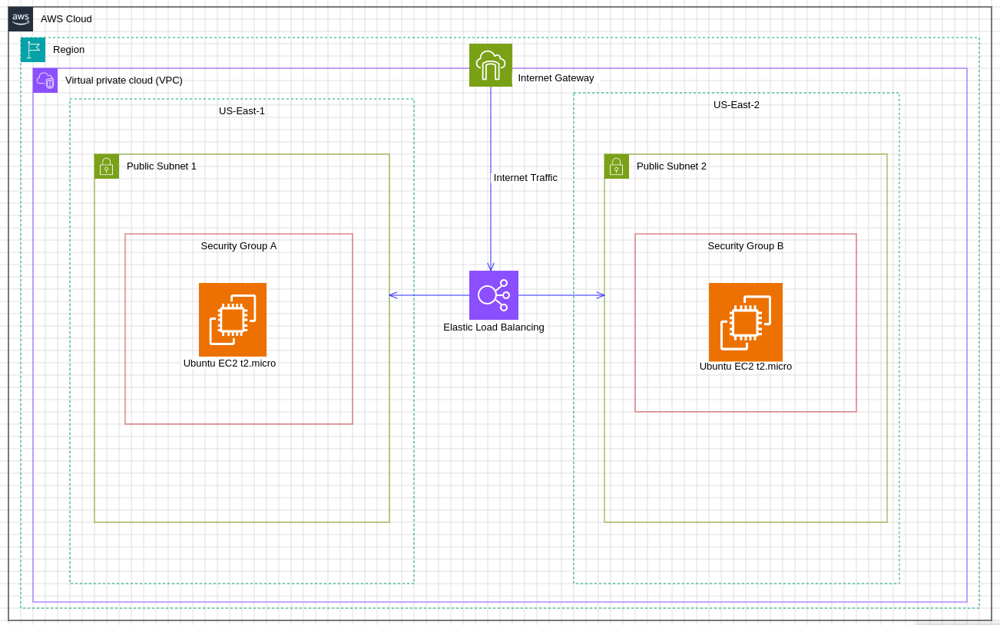

# Architecting a Highly Available AWS Solution for MetaTrader 5 on Ubuntu 22.04 LTS

## Overview
This project aims to architect a highly available AWS solution for running MetaTrader 5 (MT5) on an Ubuntu 22.04 LTS EC2 instance using Terraform to automate the infrastructure setup. A highly available architecture ensures minimal downtime and redundancy, providing continuous operation despite failures or maintenance activities. This is crucial for applications like MT5, a popular trading platform, where continuous uptime and reliability directly impact trading performance and user satisfaction.

MetaTrader 5 is widely used by traders for automated trading, market analysis, and executing complex trading strategies. Running MT5 on Ubuntu 22.04 LTS using Wine allows traders to leverage the stability and performance of the Linux environment while running Windows-based MT5 seamlessly.

## Architecture Diagram
The architecture includes the following key components:

1. **EC2 Instances**: Primary and secondary instances running Ubuntu 22.04 LTS with MT5 installed via Wine.
2. **Elastic Load Balancer (ELB)**: Distributes incoming traffic across multiple EC2 instances to ensure no single instance becomes a point of failure.
3. **Auto Scaling Group**: Automatically adjusts the number of EC2 instances in response to traffic patterns, ensuring optimal performance and availability.
4. **Amazon RDS**: Managed relational database service for storing trading data, configurations, and logs.
5. **S3 Bucket**: For storing backups, logs, and other essential data.
6. **CloudWatch**: For monitoring and alerting, ensuring the system's health and performance are continuously tracked.

## Prerequisites
To get started with this project, ensure you have the following prerequisites:

1. **AWS Account**: An active AWS account to create and manage resources.
2. **Terraform**: Installed on your local machine. Follow the official [Terraform installation guide](https://learn.hashicorp.com/tutorials/terraform/install-cli) if you don't have it installed.
3. **AWS CLI**: Installed and configured with your AWS credentials. Refer to the [AWS CLI installation guide](https://docs.aws.amazon.com/cli/latest/userguide/install-cliv2.html) for instructions.
4. **SSH Key Pair**: For accessing EC2 instances. You can create a new key pair in the AWS Management Console if you don't have one.
5. **IAM Role**: With sufficient permissions to manage EC2, ELB, Auto Scaling, RDS, S3, and CloudWatch resources.
6. **Ubuntu 22.04 LTS AMI**: The AMI ID for Ubuntu 22.04 LTS in your preferred region.
7. **Wine and MetaTrader 5 Setup Files**: Downloaded and ready to be installed on the EC2 instances.

By following this README, you'll be able to deploy a highly available and resilient MT5 trading environment on AWS using Terraform, ensuring continuous operation and optimal performance for your trading activities.
